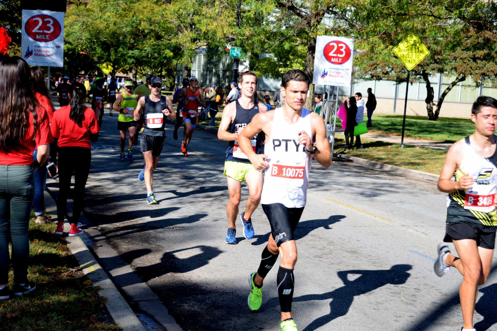
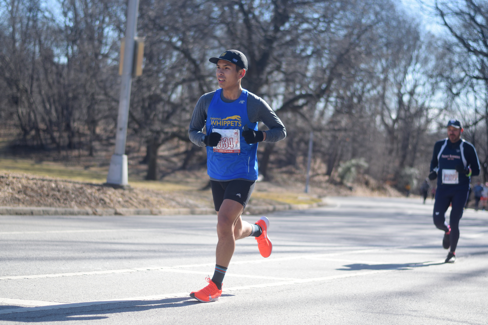
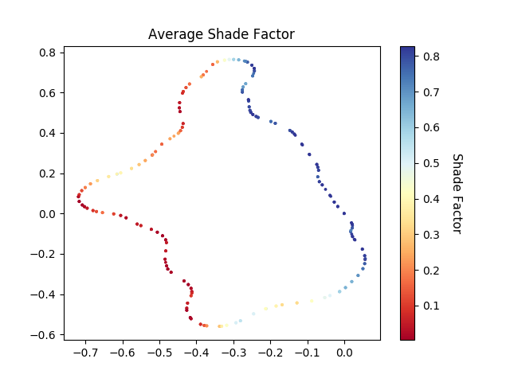

## ShadeGPX

Simple code to determine the best spots for race photography on a course (assuming bright sunlight and no local sources of shade!). Most of the information below can also be found on [my blog post](https://www.benmayersohn.com/2019/03/made-in-the-shade/).

### Motivation

I run [a blog](https://www.cheereverywhere.com) that documents my efforts to cheer on and snap photos of (primarily) NYC-area runners. The biggest enemy of outdoor photography is strong sunlight directly on the subject. Because these races tend to happen early in the morning, the sun shines at enough of an angle to avoid the [perils of high noon](https://www.ldavidlikesphotography.com/blog/best-time-of-day-for-outside-pictures). But if I don’t pick my cheer spots carefully, I might end up in a situation where the sun shines on the runners’ front side. This makes them glow in an unflattering way. Check out the one below from the 2017 Chicago Marathon:

Note that the shadow is cast to the side of the runner. This conundrum made me realize that I should be studying the location of the sun in advance, to determine which cheer spots would be ideal. We want the sun to be behind the runners, so a shadow is cast in front of them. The photo below, taken at this year’s [PPTC Cherry Tree 10 Miler](https://pptc.org/cherry), provides an example of this phenomenon.

If I know where the sun is at each time of the day, and I know the course, I should be able to determine the amount of sunlight projected in front of the runner in the worst case scenario – no clouds. I then want to pick the cheer spot that maximizes a “shade metric” over the course of the race.

### "Shade Factor"

The formula I use has three main properties:
* If the runners are directly facing the sun, the shade factor is 0 (worst possible value)
* If the runners face the opposite direction of the sun, the shade factor is equal to a perfect value of 1.0 at sunrise/sunset.
* The shade factor approaches 0 as the sun altitude increases towards 90 degrees.

See [my blog post](https://www.benmayersohn.com/2019/03/made-in-the-shade/) for the formula, as GitHub isn't great with rendering math symbols.

**Note**: The formula is an oversimplification. First, we disregard the effect of local changes in elevation (e.g. hills) on this value. Second, as mentioned above, we’re going to assume the worst case scenario (no clouds), as we cannot predict cloud positions on race day. Lastly, and most importantly, we do not include trees, buildings, or any other possible local sources of shade. This again ties into the worst case scenario where the only shadows are the ones cast by the runners.

### Files

Here is the structure of our repository:
<pre class="language-bash"><code class="language-bash">
shadegpx
|____badangle.jpg           # good shot photo shade in front of the runner
|____goodangle.jpg          # bad photo with a lot of harsh sunlight in the runner's face
|____examples               # examples of GPX files, scripts to calculate shade factors, and output plots
|____shadegpx            
| |____shadegpx.py          # contains tools for computing shade factor
|____setup.py               # for installation purposes
|____output                 # directory with output of simulations
|____README.md
|____download_race_gpx.py   # script for downloading GPX file from race URL on Strava
</code></pre>

The file `shadegpx.py` contains two functions: `shade_factor`, which computes the above metric using the required parameters; and `shade_calc` which takes a GPX file, start time, and end time and returns the average shade factor at each coordinate over the specified duration.

My code makes use of the wonderful [PySolar](https://pysolar.readthedocs.io/en/latest/) library to calculate the sun elevation and azimuth at each time.

### Examples

I've included two examples: the PPTC Cherry Tree 10 miler Prospect Park (3 loops of the park) and another for the NYC Half on March 17th. Just run the scripts and they will produce a plot of the course and the shade factors at each point. I haven't yet tried to overlay the output on a map, but you can view the [Prospect Park route](https://www.strava.com/routes/17416328) and [NYC Half route](https://www.strava.com/routes/17561845) on Strava. It'll be easier to interpret the output this way.

Below is the result for the Prospect Park 10 miler:

